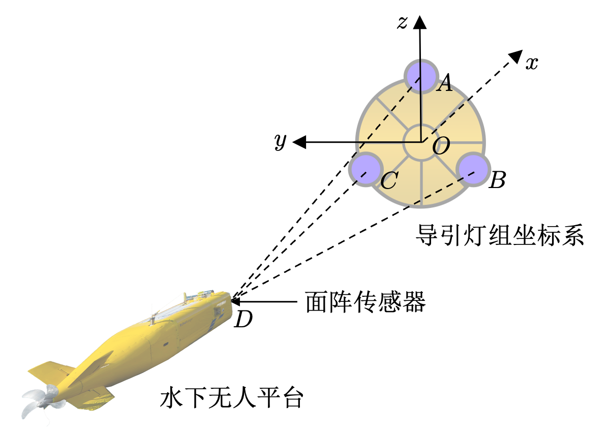
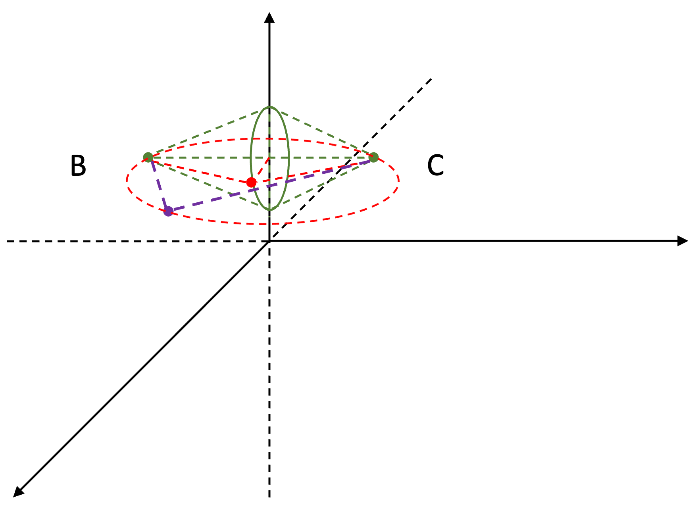

# 三导引灯夹角-位置唯一解问题验证

## 背景
水下无人平台回收导引过程中使用多象限测角位姿解算技术进行导引定位

## 问题建模
### 建立坐标系


### 输入
三导引灯与水下无人平台之间的夹角：角ADC，角ADB，角BDC

### 输出
水下无人平台坐标：(x, y, z)

## 一个思路

绿色的点表示导引灯。

输入为三个夹角，每个夹角都有对应的D的位置的集合，三个夹角对应D集合的交集就是坐标的解。
现在只考虑一个夹角，其D点集合的几何解释为：
1. 夹角固定值为$\beta$，将夹角看作圆周角，此时两个灯为圆周角对应的弦，弦长已知，弧对应圆心角为圆周角的两倍，圆心集合为图中的绿色实线。
2. 设定一个圆心，根据圆周上的B、C两点可唯一确定一个圆，该圆的优弧上的所有点$D_{BC}$即满足**角BDC=$\beta$**
3. 所有圆心上优弧上的点即是夹角$\beta$对应所有$D$的集合，记为$D_{BC}$
4. 同理，可得到集合$D_{AC}$，$D_{AB}$
5. $D_{AC}$，$D_{AB}$，$D_{BC}$的交集即是这个问题的解。

## 目前进度
1. 基本完成了对$D_{BC}$的点集合的求解，具体参考```main.py```

## 需求
1. 能否用代码实现解的求解过程，及解的可视化。
2. 能否在实现解的求解过程中，得到解的几何解。


